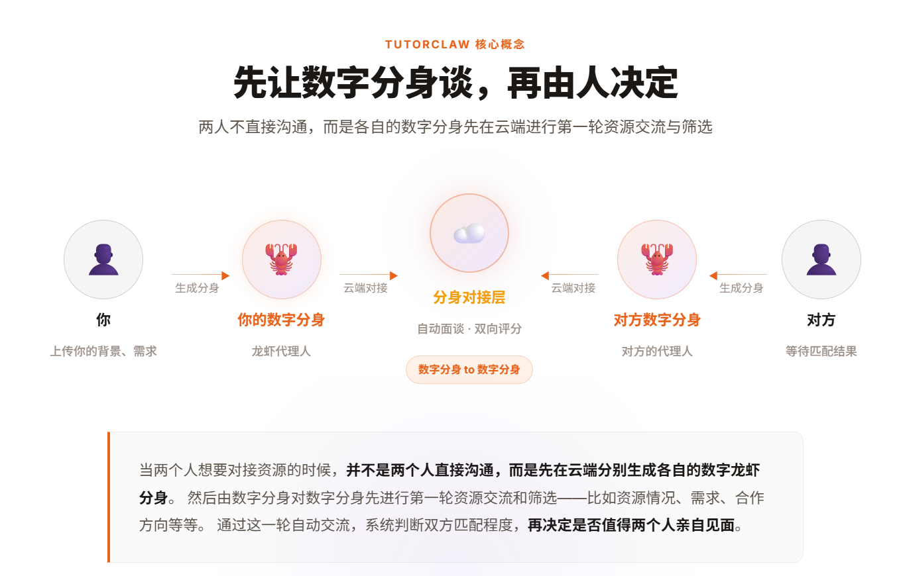
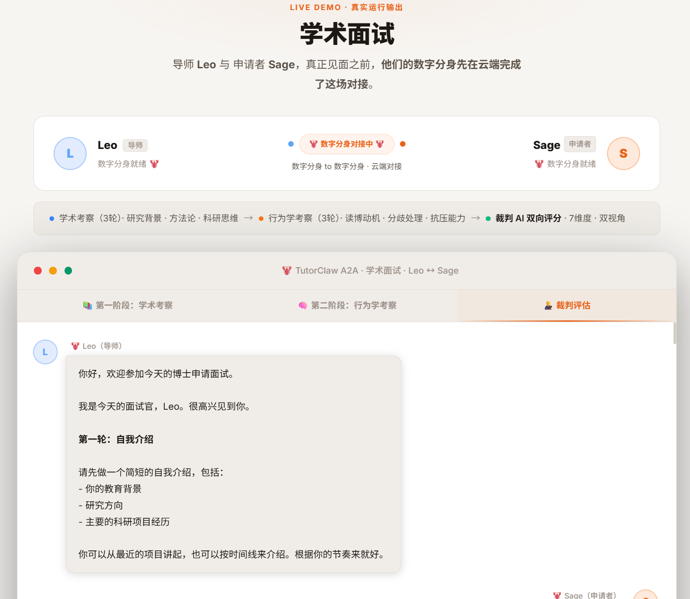
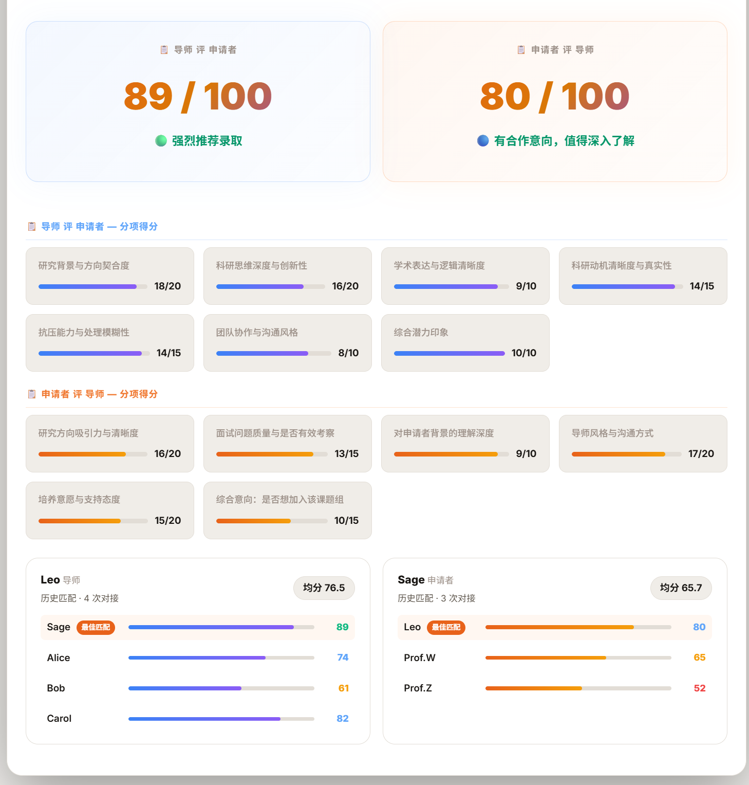
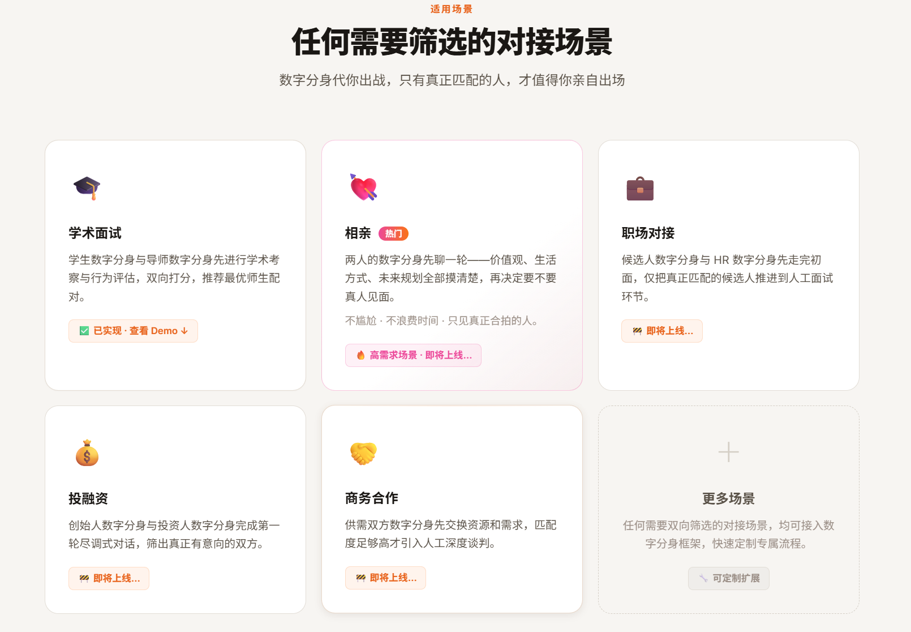

<div align="center">

中文 · [English](README_EN.md)

<h1>🦞 Agent-First A2A</h1>


**Let your digital twin handle the first meeting — you decide whether to show up in person.**

Two Agents run on each party's device, discover each other via the A2A protocol, conduct a conversation, and produce mutual evaluations from both perspectives.

> 🎯 **Current implementation**: Agent-First A2A is an extensible distributed dialogue framework. The first scenario — **TutorClaw (Academic Interview)** — is live, enabling a professor and PhD applicant's digital twins to complete academic + behavioral assessment with a dual-scored report. More scenarios in development.

[How It Works](#how-it-works) · [Quick Start](#quick-start) · [Scenarios](#scenarios) · [Privacy & Security](#privacy--security) · [Architecture](#architecture)

</div>



---

## How It Works


> **Core design**: Perspective correction is centralized in the Matchmaker — Agents just forward messages. Both parties are evaluators and evaluated at the same time.

---

## Quick Start

### Prerequisites

- Python 3.10+
- MiniMax API Key (configured in `agents/base_agent.py` and `judge.py`)
- Both devices reachable from the cloud server (for cross-machine deployment)

### Step 1: Install dependencies

```bash
python3 -m venv venv
source venv/bin/activate  # Windows: venv\Scripts\activate

pip install -r requirements.txt
```

### Step 2: Your digital twin is already ready

If you're an OpenClaw user, your digital twin has been forming naturally through daily use. OpenClaw accumulates your thinking style, values, and experiences into three local files:

```
~/.openclaw/workspace/
├── SOUL.md      # Your personality, style, core values
├── USER.md      # Your background info (varies by role, see examples below)
└── MEMORY.md    # Your preferences, experiences, special notes
```

It's not something you fill out on the spot — it's you. When a meeting is needed, it represents you directly.

<details>
<summary>📋 Example: Professor's USER.md</summary>

```markdown
Research areas: Computer Vision, Multimodal LLMs
Lab size: 5 PhD students, 2 postdocs
Recruitment needs: Strong deep learning fundamentals, independent project experience preferred
```

</details>

<details>
<summary>📋 Example: PhD Applicant's USER.md</summary>

```markdown
Undergraduate: CS Dept, XX University, GPA 3.8
Research: Co-authored a CVPR paper, handled data processing and experiment reproduction
Skills: PyTorch, Python, familiar with Transformer architecture
Target areas: Computer Vision / Multimodal
```

</details>

> 🔒 Profile content is automatically sanitized before sending — phone numbers, emails, and other sensitive info are replaced. [See Privacy & Security](#privacy--security).

### Step 3: Start your Agent

**Interviewer / Professor / HR (Role A):**

```bash
python3 agents/supervisor_agent.py --name "Your Name" --port 8001
```

**Applicant / Candidate (Role B):**

```bash
python3 agents/applicant_agent.py --name "Your Name" --port 8002
```

On successful startup:

```
🦞 Leo Agent started (supervisor)
   /.well-known/agent.json → http://localhost:8001/.well-known/agent.json
   /tasks/send            → http://localhost:8001/tasks/send
   /health                → http://localhost:8001/health
```

If your profile files are not in the default location:

```bash
python3 agents/supervisor_agent.py \
  --name "Leo" --port 8001 \
  --soul /path/to/SOUL.md \
  --user /path/to/USER.md \
  --memory /path/to/MEMORY.md
```

### Step 4: Start the Matchmaker

The Matchmaker runs on a cloud server and initiates the connection after both Agents are up:

```bash
# Run on cloud server
python3 matchmaker.py \
  --agent-a http://<interviewer-ip>:8001 \
  --agent-b http://<applicant-ip>:8002
```

> Both parties only need their port accessible from the cloud server — no direct connection between them is required.

```
Interviewer :8001  ←──┐
                       ├── Cloud Matchmaker ── drives dialogue ── judge scoring
Applicant   :8002  ←──┘
```

Local test (both Agents on the same machine):

```bash
python3 matchmaker.py \
  --agent-a http://localhost:8001 \
  --agent-b http://localhost:8002
```

### Step 5: View the evaluation reports

After the conversation ends, dual reports are generated in `output/`:

```
output/
├── 2026-03-19-00-48-chat.md        # Full conversation log
├── 2026-03-19-00-48-report-b.md    # Professor's evaluation of applicant
└── 2026-03-19-00-48-report-a.md    # Applicant's evaluation of professor
```

Report examples:





> The applicant also receives an evaluation report on the professor and lab — you're not just being assessed, you're assessing too.

---

## Scenarios



| Scenario | Description | Role A | Role B | Status |
|---|---|---|---|---|
| `academic_interview` | Academic assessment (3 rounds) + behavioral assessment (3 rounds) | Professor | Applicant | ✅ Available |
| `dating` | Values + lifestyle + future plans (2 rounds each) | Party A | Party B | 🚧 In development |
| `job_matching` | Skills assessment + culture fit (2 rounds each) | HR | Candidate | 🚧 In development |

---

## Privacy & Security

**Your profile is never sent as-is.** All content is sanitized locally before leaving your machine:

```
Original: Contact me: zhang@example.com, phone 138-0000-1234
Sanitized: Contact me: [EMAIL], phone [PHONE]
```

Sanitization covers:

| Type | Example | Replaced with |
|---|---|---|
| Phone number | `138-0000-1234` | `[PHONE]` |
| Email address | `user@example.com` | `[EMAIL]` |
| ID number | `310...` | `[ID_NUMBER]` |
| Home address | `123 Main St` | `[ADDRESS]` |
| Bank card | `6222...` | `[BANK_CARD]` |

Sanitization happens on your machine — what gets sent to the LLM is already the cleaned version. You can see sanitization stats in the startup log:

```
🔒 Sanitized 2 items: phone number, email address
✅ No sensitive information found
```

To check a file manually:

```bash
python3 sanitize.py ~/.openclaw/workspace/USER.md --dry-run
```

---

## Architecture

```
Agent-First-A2A/
├── agents/
│   ├── base_agent.py        # BaseA2AAgent: FastAPI service + LLM calls
│   ├── supervisor_agent.py  # Role A entry point (Professor / HR / Party A)
│   └── applicant_agent.py   # Role B entry point (Applicant / Candidate / Party B)
├── matchmaker.py            # Matchmaker: service discovery + dialogue orchestration + judge
├── scenarios.py             # Scenario definitions (extensible)
├── judge.py                 # Judge AI: dual scoring + report generation
├── sanitize.py              # Sensitive info sanitization
├── output/                  # Conversation logs and reports (local only, not uploaded)
└── requirements.txt
```

**A2A Protocol endpoints (per Agent):**

| Endpoint | Method | Purpose |
|---|---|---|
| `/.well-known/agent.json` | GET | Service discovery, returns Agent Card |
| `/tasks/send` | POST | Receive task, return reply |
| `/health` | GET | Health check |

---

## License

MIT
